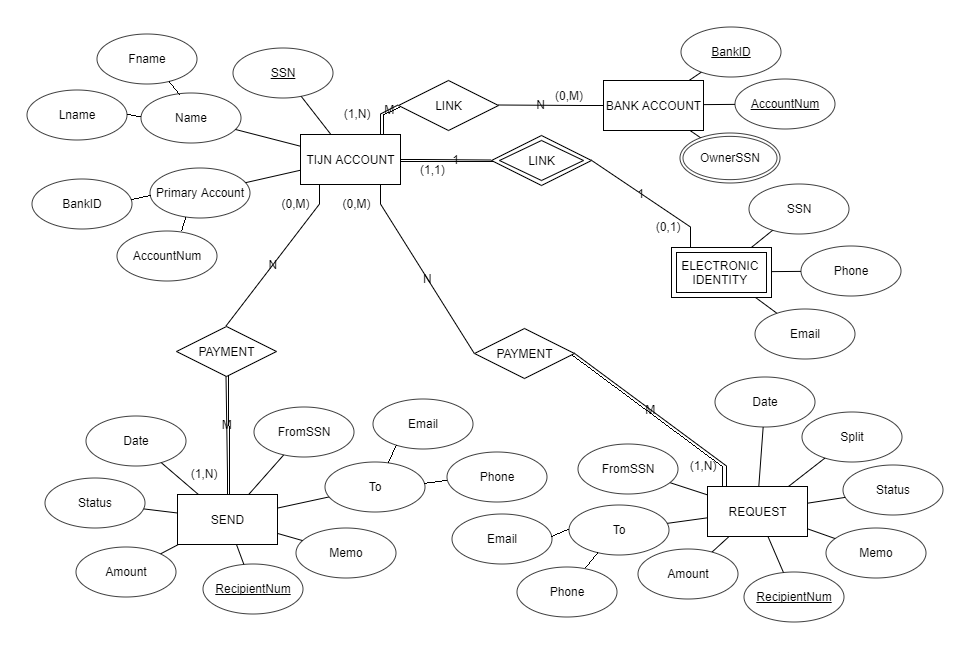
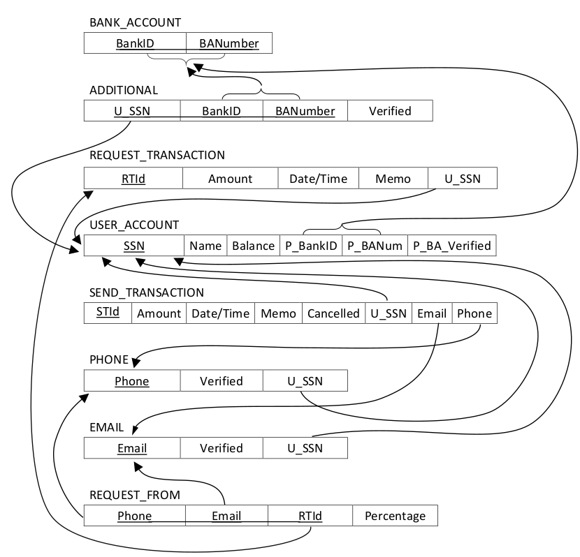

# CS 631101-Data Mgt Systems Design
## Introduction
This project is written by C++ under Qt SDK.

The database used was MySQL. The program was compiled in Qt framework. Qt has an SQL module to connect the database and the application. QSqlDatabase connects the database while the QSqlQuery function sends SQL commands to the SQL server. 

One of the big problem encountered was the amount of setup required just to connect to the database. Despite the large amount of theory we learned in class, practical application still proves to be quite difficult. It is hard to consider and plan for all possible situations and conditions for the application. There was a lot of trial-and-error.

## Project Describtion
TJIN is a payment network, similar to Venmo and Zelle.

User can sign up, sign in, link/unlink bank accounts, verify bank accounts. 

User can send money to another user and request money from other users.

All the data should store in Database.

## First ER Diagram

## First Relational Schema

## SQL table

### bank_account
| NAME             | ATTRIBUTE
| :--------------  |:--------------  
| BankID           | varchar(9)
| BANumber         | varchar(9)

### electronic_address
| NAME       | ATTRIBUTE
| :-------   | :-------
| Type       | varchar(1)
| SSN        | varchar(9)
| Identifier | varchar(45)
| Verified   | varchar(1)

### from_
| NAME      | ATTRIBUTE
| :-------  | :-------
|RTid       | varchar(9)
|Identifier | varchar(45)
|Percentage | double
|Status     | varchar(1)

### has_additional
| NAME      | ATTRIBUTE
| :-------  | :-------
| SSN       | varchar(9)
| BankID    | varchar(9)
| BANumber  | varchar(9)
| Verified  | varchar(1)

### register_account
| NAME      | ATTRIBUTE
| :-------  | :-------
| USERNAME  | varchar(15)
| PASSWORD  | varchar(15)
| SSN       | varchar(9)

### request_transaction
| NAME      | ATTRIBUTE
| :-------  | :-------
| RTid      | varchar(9)
| Amount    | double
| DateTime  | datetime
| Memo      | varchar(45)
| SSN       | varchar(9)

### send_to_bank
| NAME      | ATTRIBUTE
| :-------  | :-------
| SSN       | varchar(9)
| Amount    | double
| DateTime  | datetime

### send_transaction
| NAME      | ATTRIBUTE
| :-------  | :-------
| STid      | varchar(9)
| Amount    | double
| DateTime  | datetime
| Memo      | varchar(45)
| Cancelled | varchar(1)
| SSN       | varchar(9)
| Identifier| varchar(45)

### user_account
| NAME       | ATTRIBUTE
| :-------   | :-------
| SSN        | varchar(9)
| Name       | varchar(15)
| Balance    | double
| BankID     | varchar(9)
| BANumber   | varchar(9)
| PBAVerifier| char(1)
