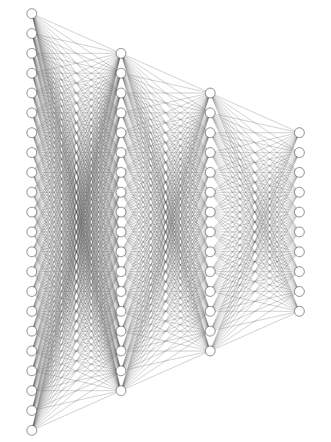

# Simple perceptrons
## compile:
python3 perceptrons
## output:
figure of loss and accuracy
## structure:

The first layer is 28*28 mnist image input

The second layer is 14*14 

The third layer is 7*7

The output layer is 10 which indicate 0 to 9
